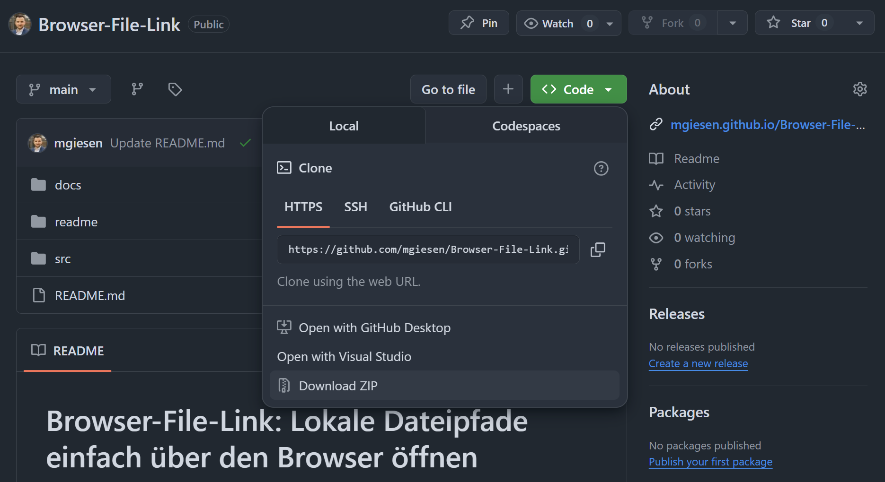

# Browser-File-Link: Lokale Dateipfade einfach über den Webbrowser öffnen

In vielen Unternehmensumgebungen ist es eine Herausforderung, direkt von Webanwendungen auf lokale Dateipfade (z.B. auf einem Firmen-Fileserver) zuzugreifen. Browser blockieren aus Sicherheitsgründen das direkte Öffnen von `file://`-URIs, was die Integration von internen Ressourcen erschwert.

**Browser-File-Link** ist eine schlanke PowerShell-Lösung, die genau dieses Problem umgeht. Sie startet einen einfachen lokalen HTTP-Server, der als Brücke zwischen deinem Browser und deinem lokalen Dateisystem fungiert. So kannst du Projektordner, Dokumente oder Tools, die auf einem Netzlaufwerk oder Fileserver liegen, bequem aus Anwendungen wie Microsoft Teams, SharePoint-Listen oder internen Webseiten heraus öffnen.

Der Dienst ist so gestaltet, dass er i.d.R. ohne lokale Admin-Rechte genutzt werden kann. 


## Einrichtung und Verwendung

### Einfache Anleitung

1. Klicke auf den `Code`-Button und wähle `Download ZIP`, um den Dienst herunterzuladen.  
  
2. Entpacke die ZIP-Datei an einen festen Speicherort deiner Wahl.
3. Öffne den entpackten Ordner, gehe in das Verzeichnis `src` und starte den Dienst per Doppelklick auf `Start Service.vbs`.
4. Wenn du möchtest, dass der Dienst automatisch beim Systemstart ausgeführt wird, starte `Zum Autostart hinzufügen.bat` per Doppelklick.

### Links erstellen und verwenden

#### Option A: Redirect-Link (für Teams, SharePoint etc.)

```
https://mgiesen.github.io/Browser-File-Link/?open_path=\\FirmenServer\Projekte\ProjektX
```

**Vorteil:**

- Wenn der Dienst bei einem Anwender bereits installiert ist, erfolgt automatisch ein nahtloser Redirect und lokale Ausführung
- Wenn **nicht**, erhält der Anwender eine Information über die Notwendigkeit den Dienst zu installieren

#### Option B: Direkter Link (nur für persönlichen Gebrauch empfohlen)

```
http://localhost:55555/?open_path=C:/Dein/Pfad
```

**Vorteil:** 
- Sehr einfach und direkt
- Wenn ein Anwender den Link anklickt, ohne dass der Dienst auf seinem Computer ausgfeührt wird, erhält er eine Fehlermeldung im Browser (z. B. HTTP-Fehler 404), da keine Verbindung zum lokalen Server hergestellt werden kann. Dies kann zu Irritation führen. 

## Einrichtung von Microsofts Lists für die einfache Verwendung

Für eine einfache und dynamische Verlinkung von Dateipfaden in Microsoft Lists folge diesen Schritten:

1. Erstelle eine Textspalte, in die der gewünschte Dateipfad eingetragen wird
1. Erstelle eine Hyperlinkspalte, in der Links zum öffnen der Dateipfade erscheinen
1. Wähle in den Spalteneinstellungen der Hyperlinkspalte die Formatierungseinstellungen
1. Wähle den erweiterten Modus und nutze folgendes JSON Beispiel
1. Passe den Spaltennamen für den Dateipfad an

```json
{
  "$schema": "https://developer.microsoft.com/json-schemas/sp/v2/column-formatting.schema.json",
  "elmType": "a",
  "txtContent": "Pfad öffnen",
  "attributes": {
    "target": "_blank",
    "href": "='https://mgiesen.github.io/Browser-File-Link//?open_path=' + [$Projektordner]"
  }
}
```

## Beitrag

Ideen, Feedback und Pull Requests sind willkommen!
