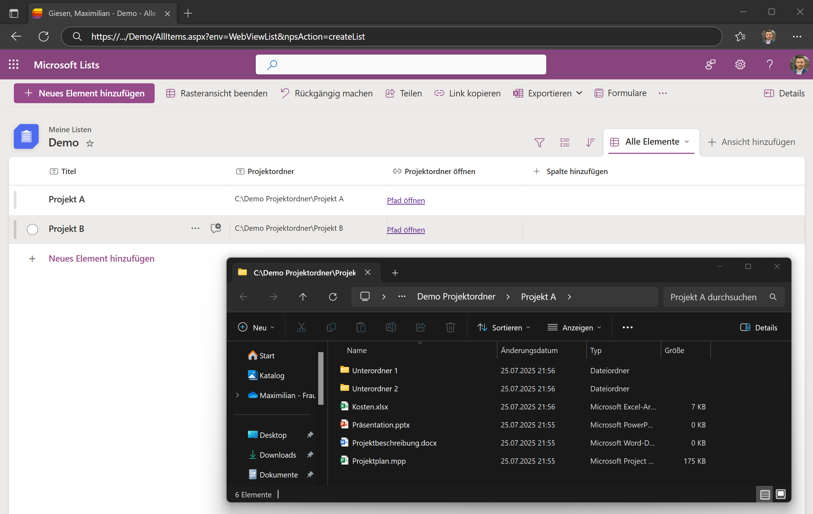

# Browser-File-Link: Lokale Dateipfade einfach über den Browser öffnen

In vielen Unternehmensumgebungen ist es eine Herausforderung, direkt von Webanwendungen auf lokale Dateipfade (z.B. auf einem Firmen-Fileserver) zuzugreifen. Browser blockieren aus Sicherheitsgründen das direkte Öffnen von `file://`-URIs, was die Integration von internen Ressourcen erschwert.

**Browser-File-Link** ist eine schlanke PowerShell-Lösung, die genau dieses Problem umgeht. Sie startet einen einfachen lokalen HTTP-Server, der als Brücke zwischen deinem Browser und deinem lokalen Dateisystem fungiert. So kannst du Projektordner, Dokumente oder Tools, die auf einem Netzlaufwerk oder Fileserver liegen, bequem aus Anwendungen wie Microsoft Teams, SharePoint-Listen oder internen Webseiten heraus öffnen.



## Funktionsweise & Anwendungsfälle

Das Skript startet einen HTTP-Listener auf deinem PC (standardmäßig Port `55555`). Zur Gestaltung der Links gibt es zwei Möglichkeiten:

### 1. Direkter Aufruf 

Du erstellst Links, die direkt auf deinen lokalen Dienst zeigen:

```
http://localhost:55555/?open_path=C:/Pfad/Zum/Ordner
```

**Vorteil:** 
- Sehr einfach und direkt

**Nachteil:** 
- Nutzen Anwender den Dienst ohne vorherige Installation, erscheint eine Fehlermeldung, da der Request nicht beantwortet wird. HTTP-Fehler 404.

### 2. Aufruf über Redirect-Seite (empfohlen für Teams & SharePoint)

Du nutzt die Redirect-Lösung über die GitHub-Seite des Projektes, die erkennt, ob der lokale Dienst läuft:

```
https://mgiesen.github.io/Browser-File-Link/?open_path=C:/Pfad/Zum/Ordner
```

**Vorteil:**

* Wenn der Dienst installiert ist: nahtloser Redirect und lokale Ausführung
* Wenn **nicht**: Nutzer sieht eine Hilfeseite mit Anleitung

## Einrichtung und Verwendung

### Repository klonen oder herunterladen

```bash
git clone https://github.com/mgiesen/Browser-File-Link.git
cd Browser-File-Link
```

### Dienst für Autostart einrichten

Führe `Zum Autostart hinzufügen.bat` per Doppelklick aus. Der Dienst startet bei jeder Windows-Anmeldung automatisch im Hintergrund. Keine Admin-Rechte nötig.

## Links erstellen und verwenden

### Option A: Direkter Link (für persönlichen Gebrauch)

```
http://localhost:55555/?open_path=C:/Dein/Pfad
```

### Option B: Redirect-Link (für Teams, SharePoint etc.)

```
https://mgiesen.github.io/Browser-File-Link/?open_path=\\FirmenServer\Projekte\ProjektX
```

> Hinweis: Bei UNC-Pfaden und Pfaden mit Leerzeichen empfiehlt sich URL-Encoding.

## Hinweise

* Das Skript muss **lokal** auf jedem Rechner laufen, der Links öffnen soll.
* Stelle sicher, dass der Port `55555` nicht von einer anderen Anwendung blockiert ist.

## Einrichtung von Microsofts Lists für die einfache Verwendung

Für eine einfache und dynamische Verlinkung von Dateipfaden in Microsoft Lists folge diesen Schritten:

1. Erstelle eine Textspalte, in die der gewünschte Dateipfad eingetragen wird
1. Erstelle eine Hyperlinkspalte, in der Links zum öffnen der Dateipfade erscheinen
1. Wähle in den Spalteneinstellungen der Hyperlinkspalte die Formatierungseinstellungen
1. Wähle den erweiterten Modus und nutze folgendes JSON Beispiel
1. Passe den Spaltennamen für den Dateipfad an

```json
{
  "$schema": "https://developer.microsoft.com/json-schemas/sp/v2/column-formatting.schema.json",
  "elmType": "a",
  "txtContent": "Pfad öffnen",
  "attributes": {
    "target": "_blank",
    "href": "='https://mgiesen.github.io/Browser-File-Link//?open_path=' + [$Projektordner]"
  }
}
```

## Beitrag

Ideen, Feedback und Pull Requests sind willkommen!
